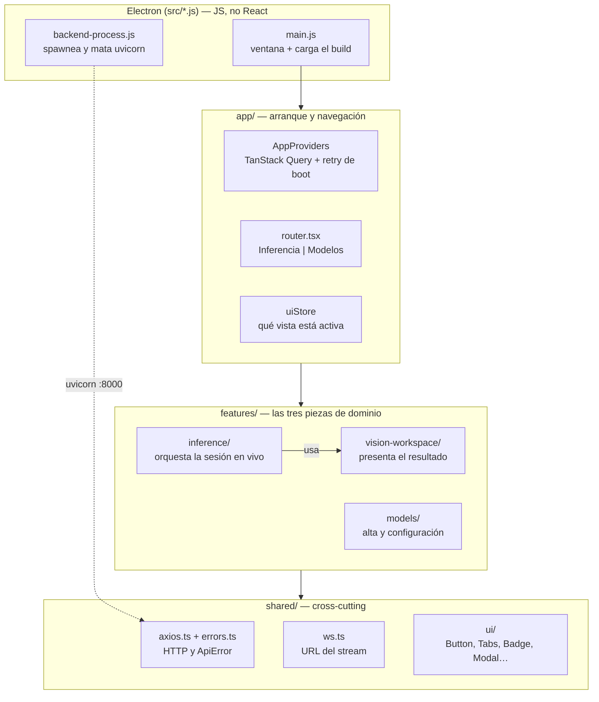
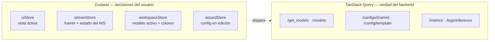
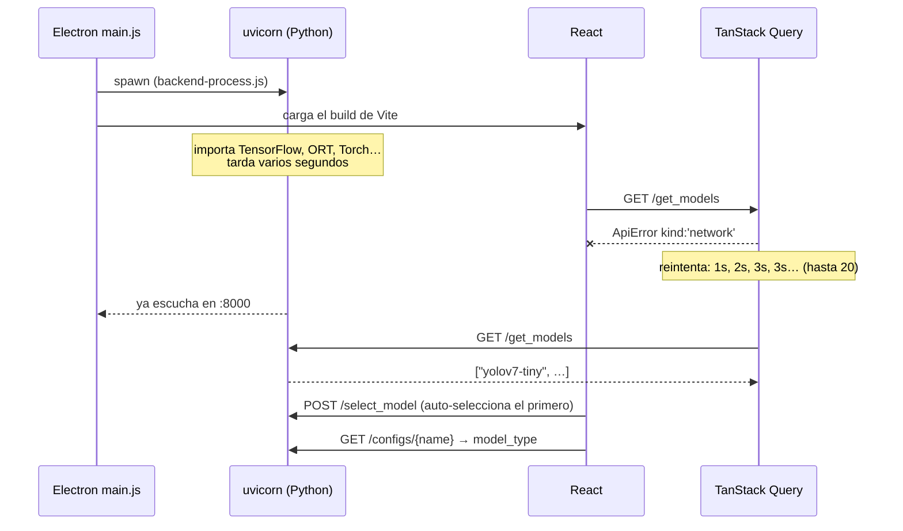
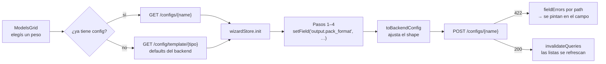

# Mapa del cliente React — cómo funciona el frontend de UNCaLens

> **Para qué sirve este documento.** Los otros cinco archivos de esta carpeta
> (`app-shell.md`, `feature-inferencia.md`, `vision-workspace.md`, `feature-modelos.md`,
> `plataforma-electron.md`) documentan la **migración**: describen el frontend viejo de JS
> vanilla y cómo se mapeaba al nuevo. Son registro histórico y referencia componente por
> componente. Este documento es distinto: describe **el cliente que existe hoy**, siguiendo
> los tres flujos que realmente ocurren cuando la app corre. Se lee de arriba a abajo, una
> sola vez, y después alcanza con la tabla de la sección 7 para saber dónde tocar.
>
> Escrito el 2026-08-13 contra el código de la rama `refactor-frontend-react`.

---

## 1. La idea en una frase

**El cliente no sabe nada de visión por computadora.** Saca fotos, las manda por un caño,
recibe una lista de números, y dibuja rectángulos con esos números. No conoce modelos, ni
tensores, ni umbrales, ni letterbox. Todo lo demás que hay en `client/src/` es plomería
alrededor de ese intercambio: elegir de dónde salen las fotos, mostrar qué modelo está
cargado, y ofrecer un formulario para describir modelos nuevos.

Si en algún momento el código parece más complicado que eso, es plomería. Volvé a esta
frase.

---

## 2. Las cuatro capas



Las reglas de dependencia, que son las que mantienen esto ordenado:

- **`shared/` no importa nada de `features/`.** Es la capa de abajo: cliente HTTP, tipos del
  backend, primitivos visuales. Si algo en `shared/` necesita saber de una feature, está mal
  ubicado.
- **`inference/` depende de `vision-workspace/`, nunca al revés.** Inferencia es el dueño del
  ciclo de vida (cámara, WebSocket, refs); vision-workspace solo sabe pintar lo que le pasan.
  Esa flecha va en un solo sentido a propósito: podés cambiar completamente cómo se dibuja sin
  tocar el transporte.
- **`models/` no habla con `inference/`.** Se comunican indirectamente: models escribe configs
  en el backend, inference las lee vía HTTP. No comparten estado en memoria.

---

## 3. El loop caliente (esto es el 80% de la app)

Este es el flujo que corre 30 veces por segundo mientras hay una cámara activa. Es el único
lugar donde el rendimiento importa y por eso tiene reglas propias.

```mermaid
sequenceDiagram
    autonumber
    participant CAM as Cámara / archivo
    participant VID as &lt;video&gt; oculto
    participant VS as videoStream.ts<br/>(sin React)
    participant BK as Backend :8000
    participant PR as present.ts
    participant DS as detection.service.ts
    participant CV as &lt;canvas&gt; visible

    CAM->>VID: MediaStream (1280×720@30 ideal)
    loop requestAnimationFrame
        VS->>VID: ¿hay frame nuevo y no estoy esperando respuesta?
        VS->>VS: dibuja el frame en captureCanvas<br/>(con espejo si es cámara)
        VS->>BK: ws.send(blob JPEG 0.8) — binario
        Note over VS: waitingForResponse = true<br/>NO se manda otro frame
        BK-->>VS: {task, result, error}
        Note over VS: waitingForResponse = false
        VS->>PR: onMessage(payload, captureCanvas)
        PR->>CV: repinta el frame base desde captureCanvas
        PR->>DS: strategy.parse(payload) → strategy.present()
        DS->>CV: strokeRect + fillText por detección
    end
```

### Las tres invariantes que no se tocan

**Un frame en vuelo.** `waitingForResponse` bloquea el envío hasta que llega la respuesta. Sin
esto, un backend más lento que la cámara acumula frames en la cola del socket y la latencia
crece sin techo hasta que la app parece congelada. El backend está construido con la misma
suposición: responde exactamente un envelope por frame recibido, siempre, aun cuando falla.

**Timeout de 3 segundos.** Si el backend no contesta, a los 3 s el loop se libera solo y sigue
mandando. Es la red de seguridad contra el deadlock que aparece en el registro de bugs del
CLAUDE.md (#3): si el backend rompe su promesa de "siempre responde", el stream no se muere,
solo pierde ese frame.

**`captureCanvas` queda intacto.** El frame que se envió no se descarta: se guarda tal cual, y
cuando llega la respuesta se repinta desde ahí. Por eso las cajas siempre caen sobre *el frame
que las generó* y no sobre uno posterior. Es lo que evita el efecto de cajas "atrasadas" cuando
la inferencia tarda.

### Por qué React no aparece en el diagrama

Es la decisión de arquitectura más importante del cliente y la que más confunde al leerlo:
**el loop no produce ni un solo re-render de React**. Si cada frame actualizara un estado,
React reconciliaría el árbol 30 veces por segundo y el FPS se caería.

Las consecuencias, que explican varias rarezas del código:

- El transporte (`videoStream.ts`) es un módulo **sin React**: closures y variables locales, no
  hooks. Se puede leer y testear sin entender React.
- El dibujo (`detection.service.ts`) es **canvas imperativo**: `ctx.strokeRect` directo, no JSX.
- La comunicación entre ambos es por **refs** (`videoRef`, `canvasRef`, `overlayRef`), creados
  en `InferenceView` y pasados hacia abajo.
- Cuando el loop necesita leer estado —qué modelo está activo, de qué color son las cajas— lo
  hace con `useWorkspaceStore.getState()` en vez de con el hook. Leer con `getState()` **no
  suscribe** al componente, así que cambiar un color no re-renderiza nada: el próximo frame
  simplemente lee el valor nuevo. Ese es el motivo de que el slider de confianza y el color
  picker se sientan instantáneos.

---

## 4. Quién guarda qué estado

La pregunta que más rápido desbloquea la lectura del cliente es "¿dónde vive este dato?". La
respuesta es siempre una de dos:

> **Zustand guarda lo que decide el usuario. TanStack Query guarda lo que sabe el backend.**



| Store | Qué guarda | Quién escribe | Quién lee |
|---|---|---|---|
| `uiStore` | `'inference'` o `'models'` | el Header | el router, y `useVisionSession` para pausar |
| `streamStore` | la fuente activa (`none` / `camera` / `file-video` / `file-image`) y el estado del WS | `CameraSource`, `FileSource` | `useVisionSession`, que reacciona y monta la sesión |
| `workspaceStore` | modelo activo (`{name, type}`) y `drawSettings` | `ModelSelector`, `DrawSettingsModal` | el loop de render, vía `getState()` |
| `wizardStore` | la config que se está editando, el paso actual, los campos rechazados | los 4 pasos del wizard | `ConfigWizardPanel` al guardar |

Los `drawSettings` se persisten a mano en `localStorage` bajo `uncalens-draw-settings`, con
merge sobre los defaults al leer, para que una versión vieja guardada sin claves nuevas no rompa
nada.

Todo lo demás —la lista de modelos, las métricas, los logs, los templates de config— **no vive
en ningún store**. Se pide con TanStack Query, que cachea, revalida e invalida solo. Cuando el
wizard guarda una config, lo único que hace es `invalidateQueries` y las listas se actualizan
solas.

---

## 5. El arranque en frío (por qué la app tarda unos segundos)



Electron lanza uvicorn **en paralelo** con la ventana, así que las primeras peticiones salen
antes de que el backend exista. Sin manejo, la lista de modelos quedaba vacía para siempre;
ese fue el fix asociado al cierre de la migración.

La solución está en dos archivos que conviene leer juntos:

- **`shared/api/errors.ts`** normaliza *cualquier* fallo de Axios a un `ApiError` con un campo
  `kind`. `network` significa "la petición salió pero nadie contestó" y `timeout` significa
  "tardó más de 10 s". Los dos quieren decir *el backend todavía no está arriba*.
- **`app/providers/AppProviders.tsx`** usa ese `kind` para decidir la política: si el backend
  parece caído, reintenta hasta 20 veces con backoff acotado a 3 s; si el backend **sí**
  respondió pero con un error HTTP real (404, 422, 500), reintenta una sola vez, porque
  insistirle a un backend que ya dijo "no" no sirve de nada.

Ese mismo `ApiError` es el que hace legibles los errores de validación: un 422 de Pydantic llega
como una lista de objetos `{loc, msg}` y `detailToMessage` la colapsa a `"campo.subcampo:
mensaje"`, que es lo que después el wizard pinta al lado del campo culpable.

---

## 6. La vista Modelos y el round-trip del wizard

Esta es la parte más grande en líneas de código y la que menos importa entender en detalle: es
un formulario. Lo único que hay que saber es el viaje que hace la config.



Tres detalles que explican el código si te lo cruzás:

- **Los defaults no están en el frontend.** Vienen de `GET /config/template/{model_type}`, que
  el backend genera desde el schema de Pydantic. Es la "single source of truth" de la Fase 3: si
  agregás un campo al schema, el wizard lo recibe solo.
- **`setField` edita por path.** El wizard no tiene un campo por cada propiedad; tiene una
  función `setField('runtime.runtimeShapes.input_width', 640)` y un helper `setDeep` que clona e
  inserta. Por eso los pasos son cortos.
- **`toBackendConfig` es un traductor de última milla.** El wizard guarda `out_coords_space`
  dentro de `output` porque es más cómodo de editar ahí, pero el schema lo quiere en
  `runtime.runtimeShapes`. Esa función mueve el campo, anula el backend que no se usa
  (`onnx`/`tflite`) y anula `anchor_config` si el `pack_format` no es `anchor_deltas`. Es pura
  y testeable a propósito: es el único lugar donde el shape del wizard y el del backend se
  reconcilian.

---

## 7. Dónde tocar para hacer X

| Quiero… | Abro |
|---|---|
| cambiar cómo se ven las cajas (grosor, fuente, etiqueta) | `features/vision-workspace/services/detection.service.ts` |
| cambiar colores, tipografías, radios, espaciados globales | `client/src/index.css` (tokens de la piel Cabina Técnica) |
| mover paneles o cambiar el layout de Inferencia | `features/inference/InferenceView.tsx` (la grilla `200px 1fr 230px`) |
| cambiar calidad/tamaño del JPEG que se envía | `features/inference/services/videoStream.ts`, el `toBlob(..., 0.8)` |
| cambiar la resolución pedida a la cámara | `features/inference/hooks/useVisionSession.ts`, el `getUserMedia` |
| soportar un tipo de modelo nuevo (segmentación) | crear `<tipo>.service.ts` + registrarlo en `services/registry.ts` |
| agregar o quitar un campo del wizard | el `StepN*.tsx` correspondiente + `lib/wizardPresets.ts` |
| cambiar el puerto o host del backend | variables `VITE_API_URL` / `VITE_WS_URL`, leídas en `shared/api/axios.ts` y `ws.ts` |
| cambiar cuánto espera la app a que el backend arranque | `app/providers/AppProviders.tsx` (`retry` y `retryDelay`) |
| agregar una vista de primer nivel | `app/store/uiStore.ts` (el union `View`) + `app/router.tsx` |

---

## 8. Las rarezas que tienen motivo

Cosas que al leer el código parecen errores y no lo son:

**`InferenceView` nunca se desmonta.** El router la esconde con una clase `hidden` en vez de
sacarla del árbol. Si se desmontara, navegar a Modelos cerraría el WebSocket, soltaría la cámara
y al volver el navegador volvería a pedir permiso. En cambio se **pausa**: se cancela el
`requestAnimationFrame`, se ponen los tracks de video en `enabled = false`, y el socket queda
abierto. `ModelsView` sí se monta y desmonta normalmente, porque no tiene nada que preservar.

**Hay dos `useEffect` en `useVisionSession` y parecen redundantes.** No lo son: el primero
*crea y destruye* la sesión cuando cambia la fuente; el segundo solo *pausa y reanuda* cuando
cambia la vista. Están separados porque si la navegación estuviera en las dependencias del
primero, ir a Modelos reconstruiría toda la sesión desde cero. La función `syncToView()` existe
para una carrera puntual: si navegás a Modelos mientras `getUserMedia` todavía está resolviendo,
la sesión tiene que nacer ya pausada.

**Las estrategias de clasificación y segmentación existen pero están vacías.** Tienen
`implemented: false`, y `VisionWorkspace` lo usa para mostrar `UnsupportedOverlay` en vez de
fingir que funcionan. Es el espejo exacto del backend, donde esas tareas están registradas pero
devuelven 501. Cuando se implementen, el cambio en el cliente es un archivo nuevo y una línea
en `registry.ts`.

**El espejo de la cámara se aplica en el cliente, al capturar.** Está en `videoStream.ts`, en el
`scale(-1, 1)` que solo corre con `mirror: true`, y `mirror: true` solo lo pasa la rama de
cámara. Si el backend espejara, los archivos de video subidos también saldrían dados vuelta
(bug #5 del registro).

**`ModelSelector` auto-selecciona el primer modelo, una sola vez.** El `autoSelected` es un
`useRef`, no un estado, justamente para que no dispare re-renders ni se vuelva a ejecutar cuando
la lista se revalida.

---

## 9. Qué pasaría con este cliente si el backend adopta supervision

Corto: **casi nada**, y esa es la razón principal para no tirarlo.

- El transporte (`videoStream.ts`), los cuatro stores, el layout, el wizard, la capa HTTP y el
  manejo de errores **no se tocan**. Nada de eso sabe de dónde salen los números.
- Si el envelope del WebSocket cambia de forma, el impacto es **un archivo**:
  `detection.service.ts`, y dentro de él la función `parse`, que son cuatro líneas. Ese seam
  existe precisamente para eso.
- Si se implementa segmentación, el trabajo en el cliente es **un archivo nuevo**
  (`segmentation.service.ts`, que ya está como stub) más una línea en `registry.ts`. El
  contenedor —`VisionFrameContext`, el `overlayRoot`, `maskAlpha` en `drawSettings`— ya está
  previsto.

Lo que sí conviene decidir con cuidado es si el backend pasa a **dibujar** el frame anotado y
devolverlo como imagen. Eso deshace la Reforma 3 (registro de mejoras del CLAUDE.md): volverían
la doble compresión JPEG, el round-trip para cambiar un color y el problema del espejo. La
alternativa que conserva todo lo bueno es usar `sv.Detections` como tipo interno del backend y
seguir serializando JSON al cliente.
